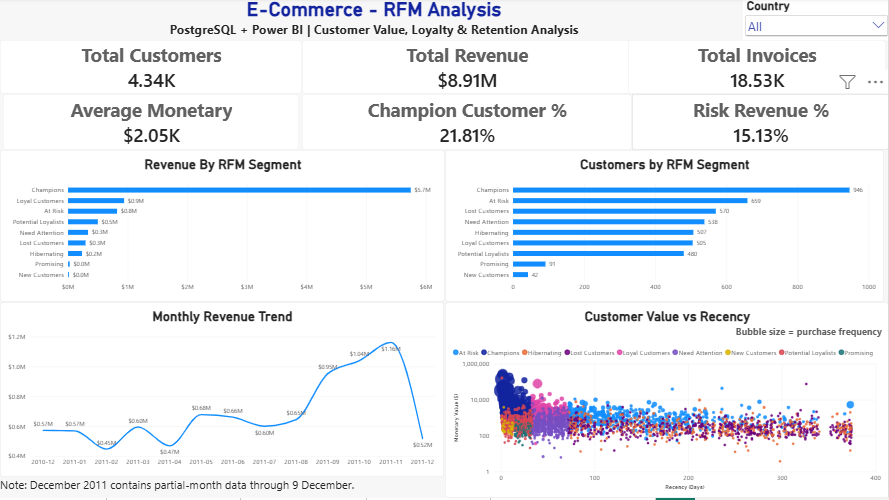
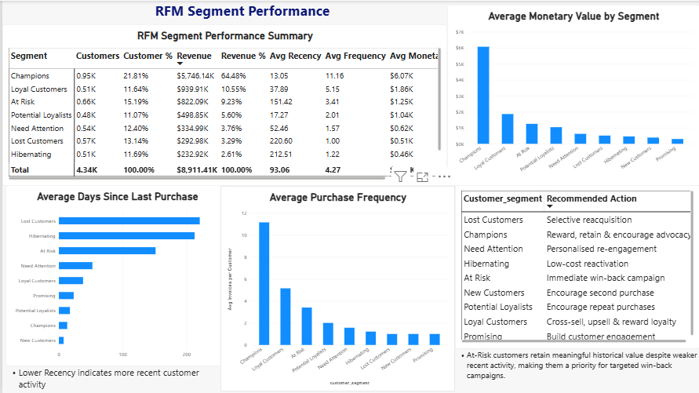
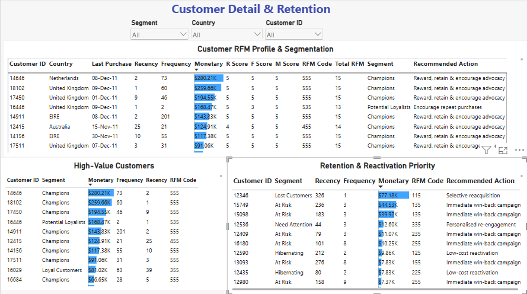
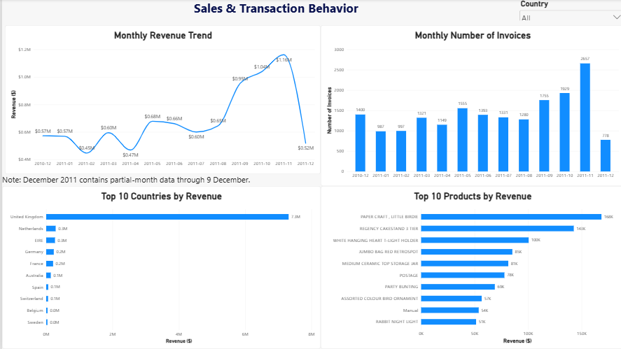
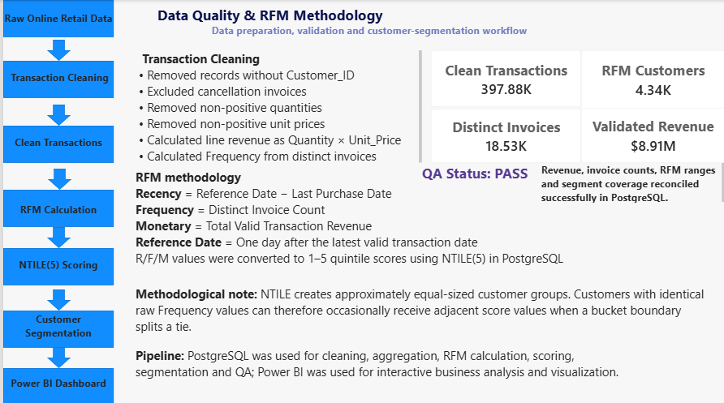

# E-Commerce Customer Segmentation Using RFM Analysis

**PostgreSQL | SQL | Power BI | RFM Analysis | Customer Analytics**

An end-to-end customer analytics project using e-commerce transaction data to develop an **RFM customer segmentation framework**, identify high-value customers, highlight retention priorities and translate transactional behaviour into actionable business insights.

---

## Project Overview

The project analyses approximately:

- **397.88K transactions**
- **4.34K customers**
- **$8.91M revenue**

Using PostgreSQL, customer-level **Recency, Frequency and Monetary (RFM)** metrics were calculated and converted into RFM scores using `NTILE(5)`.

Customers were then grouped into actionable business segments including:

- Champions
- Loyal Customers
- Potential Loyalists
- At Risk
- Lost Customers
- Other customer segments

The results were presented through a five-page Power BI dashboard.

---

## Business Objectives

The project was designed to answer five key questions:

1. Who are the most valuable customers?
2. Which customers are most engaged with the business?
3. Which customers are becoming inactive or at risk?
4. How concentrated is revenue across customer segments?
5. How can RFM segmentation support customer retention and marketing decisions?

---

## Key Findings

- Analysed **397.88K transactions** across approximately **4.34K customers**
- Total analysed revenue was approximately **$8.91M**
- The RFM framework classified customers according to:
  - Recency
  - Frequency
  - Monetary value
- **21.81% of customers generated approximately 64.48% of total revenue**
- High-value customer groups showed strong concentration of commercial value
- At-Risk and Lost segments provided clear targets for re-engagement activity
- Customer-level ranking enabled prioritisation beyond simple transaction-level reporting

---

## RFM Methodology

### Recency

Measures how recently a customer made a purchase.

Lower recency values indicate more recent engagement.

### Frequency

Measures how often a customer purchased during the analysis period.

Higher frequency indicates stronger repeat-purchase behaviour.

### Monetary Value

Measures the total revenue generated by each customer.

Higher monetary value indicates greater customer value.

### RFM Scoring

Each metric was scored using PostgreSQL:

```sql
NTILE(5)
```

This produced customer scores from **1 to 5** for Recency, Frequency and Monetary value.

The scores were then combined to support customer segmentation and business prioritisation.

---

## SQL Analytics Workflow

The PostgreSQL workflow is organised into eight project scripts.

| Script | Purpose |
|---|---|
| `01_sales_customer_analysis.sql` | Initial sales, customer and transaction analysis |
| `02_clean_transaction_data.sql` | Transaction cleaning and analytical preparation |
| `03_customer_purchase_frequency.sql` | Customer purchase-frequency analysis |
| `04_rfm_scoring.sql` | RFM metric calculation and NTILE scoring |
| `05_complete_rfm_model.sql` | Complete customer-level RFM model |
| `06_customer_segmentation.sql` | Business-rule customer segmentation |
| `07_segment_analysis.sql` | Customer segment performance analysis |
| `08_rfm_validation_data_quality.sql` | RFM validation and data-quality checks |

---

# Power BI Dashboard

The final Power BI dashboard contains five analytical pages.

## 1. Executive Overview



Provides an executive view of customer activity, revenue, transaction performance and key RFM customer metrics.

---

## 2. Segment Analysis



Compares customer segments by customer count, revenue contribution and RFM behaviour.

---

## 3. Customer Details



Provides customer-level RFM metrics and segmentation detail to support targeted customer analysis.

---

## 4. Sales Behavior



Explores sales and transaction patterns across time, geography and customer behaviour.

---

## 5. Data Quality & Methodology



Documents data preparation, analytical methodology, validation controls and RFM segmentation logic.

---

## Technical Architecture

```text
E-Commerce Transaction Data
          ↓
PostgreSQL Data Preparation
          ↓
Data Cleaning & Validation
          ↓
Customer-Level Aggregation
          ↓
Recency / Frequency / Monetary Metrics
          ↓
NTILE(5) RFM Scoring
          ↓
Customer Segmentation
          ↓
Segment & Revenue Analysis
          ↓
Power BI Semantic Model
          ↓
Interactive Power BI Dashboard
```

---

## Repository Structure

```text
ecommerce-rfm-customer-segmentation/
│
├── powerbi/
│   ├── Ecommerce_RFM_Dashboard.pbix
│   └── README.md
│
├── screenshots/
│   ├── 01_Executive_Overview.png
│   ├── 02_Segment_Analysis.png
│   ├── 03_Customer_Details.png
│   ├── 04_Sales_Behavior.png
│   ├── 05_Data_Quality_Methodology.png
│   └── README.md
│
├── sql/
│   ├── 01_sales_customer_analysis.sql
│   ├── 02_clean_transaction_data.sql
│   ├── 03_customer_purchase_frequency.sql
│   ├── 04_rfm_scoring.sql
│   ├── 05_complete_rfm_model.sql
│   ├── 06_customer_segmentation.sql
│   ├── 07_segment_analysis.sql
│   ├── 08_rfm_validation_data_quality.sql
│   └── README.md
│
└── README.md
```

---

## Skills Demonstrated

- PostgreSQL
- SQL
- Data profiling and cleaning
- Customer-level aggregation
- RFM analysis
- `NTILE()` scoring
- Customer segmentation
- Revenue analysis
- Customer-value analysis
- Retention prioritisation
- Power BI data modelling
- DAX
- Dashboard development
- Data-quality validation
- Business storytelling

---

## Business Applications

The RFM framework can support:

- customer retention campaigns
- loyalty-program targeting
- high-value customer management
- reactivation campaigns
- personalised marketing
- customer prioritisation
- revenue-concentration analysis

---

## Methodology Note

RFM segmentation is a **rule-based customer analytics framework**, not a machine-learning prediction model.

The segmentation describes historical customer purchasing behaviour based on Recency, Frequency and Monetary value. It should therefore be used as a business prioritisation tool rather than interpreted as a prediction of future customer behaviour.

---

## Project Status

**Completed**

This project demonstrates an end-to-end workflow from transactional data through PostgreSQL-based customer analytics and RFM segmentation to interactive Power BI reporting.
